# Titre : Recipe Recommendation System

 
## Domain choisi: Intelligence Artificielle

> API Flask qui recommande 5 recettes via TF-IDF selon vos ingrédients dispo. Réduit le gaspillage alimentaire.


## Objectif du projet
**Problème traite** : 30% du gaspillage alimentaire vient d’ingrédients non utilisés, besoin de sujection des recettes.
**Cible** : Particuliers qui ne savent pas quoi cuisiner avec leur fond de frigo.
**Solution** : Un moteur de recommandation qui propose des recettes réalisables avec ce qu’on a déjà dans le frigo.  
**Résultat** : Top-5 recettes pertinentes en <200ms.

## Outils Utilises Technique
| Catégorie | Outils |
| --- | --- |
| **Langage** | Python 3.11 |
| **ML/NLP** | Scikit-learn, TF-IDF, Cosine Similarity |
| **Data** | Pandas, Numpy, Parquet |
| **Interface Graphique** | Streamlit |
| **Dataset** | Food.com https://www.kaggle.com/datasets/
shuyangli94/food-com-recipes-and-user-interactions |

## Point Technique Clé
1. **Vectorisation** : Les ingrédients sont transformés en vecteurs TF-IDF pour capturer l’importance de chaque aliment.
2. **Similarité** : Cosine Similarity entre le panier utilisateur et 230k recettes.
3. **Optimisation** : Pré-calcul de la matrice TF-IDF + `joblib` pour réponse en 180ms vs 3s sans cache.

## Les Fonctionalites realisees
1. utilisation du TH-IDF pour comparer les recettes.
2. calcule de similarite cosinus.
3. graphe.
4. Filtrage.
5. interface graphique.
6. detaille sur les limites du systeme dans ce readme.md


## Etapes de realisation du Projet
### I. chargement et imporation de pandas
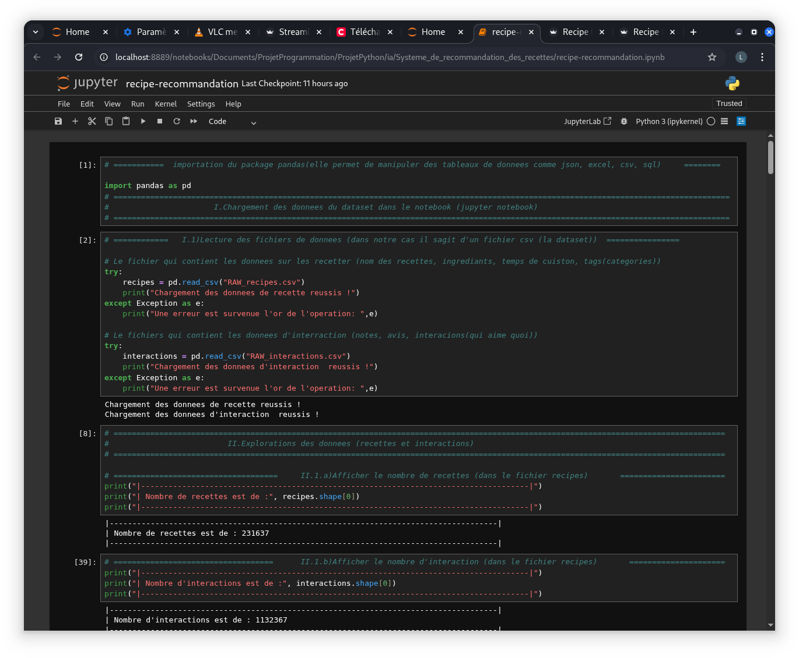
*Figure 1 : Importer pandas, Chargement des donnees du dataset dans le notebook jupyter*

### II. Exploration du dataset
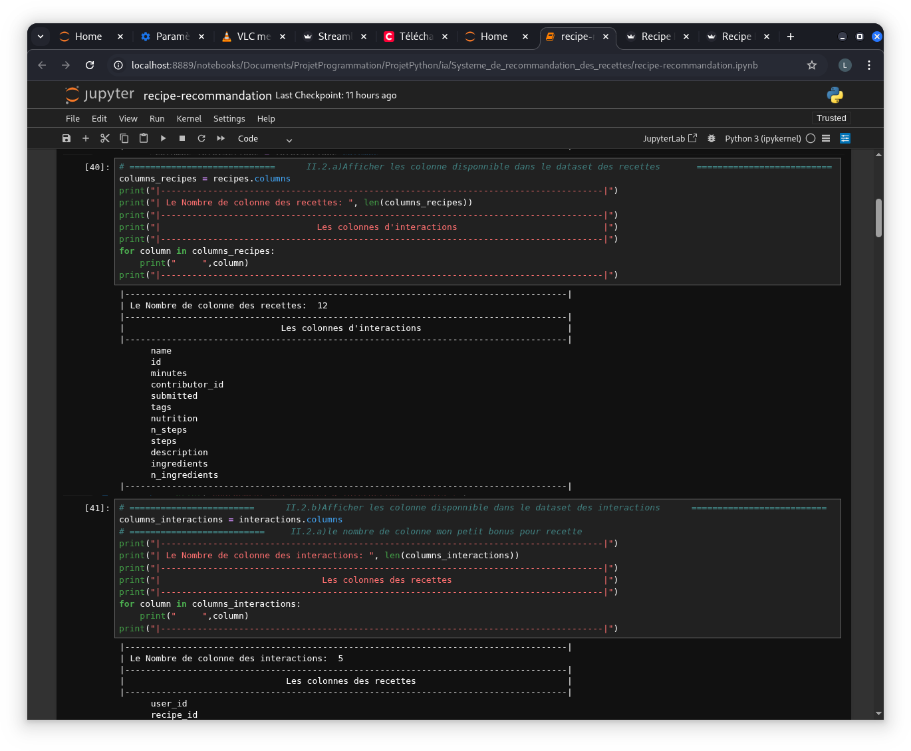
*Figure 1 : Exploration du dataset: nombre d'enregistrement et les colonnes des dataset*

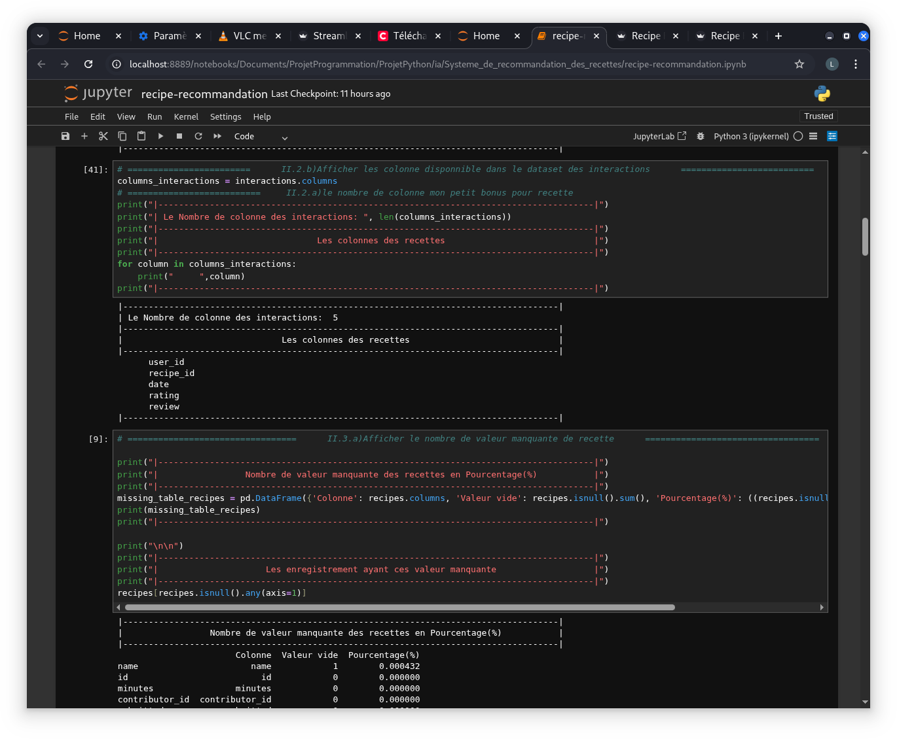
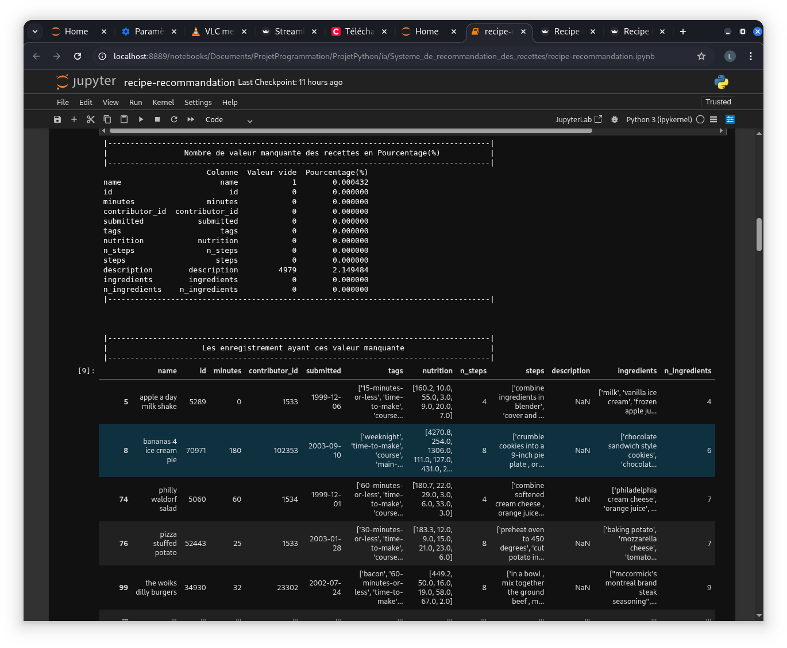
*Figure 2 :  Exploration du dataset: Affichage du nombre de valeur vide en %*

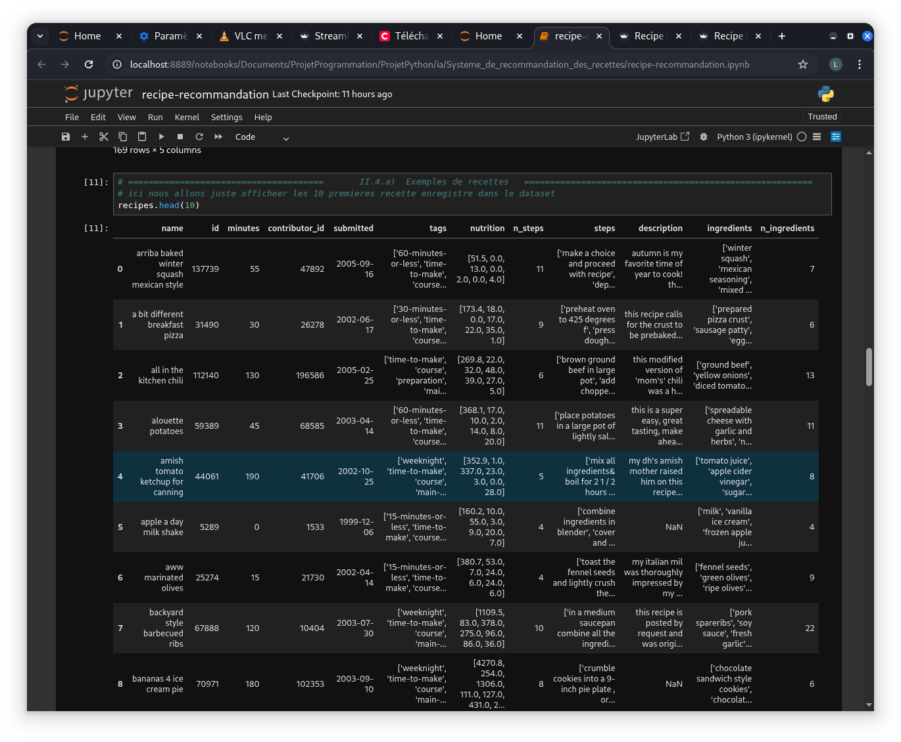
*Figure 3 :  Exploration du dataset: Affichage de quelque recette(enregistrement)*

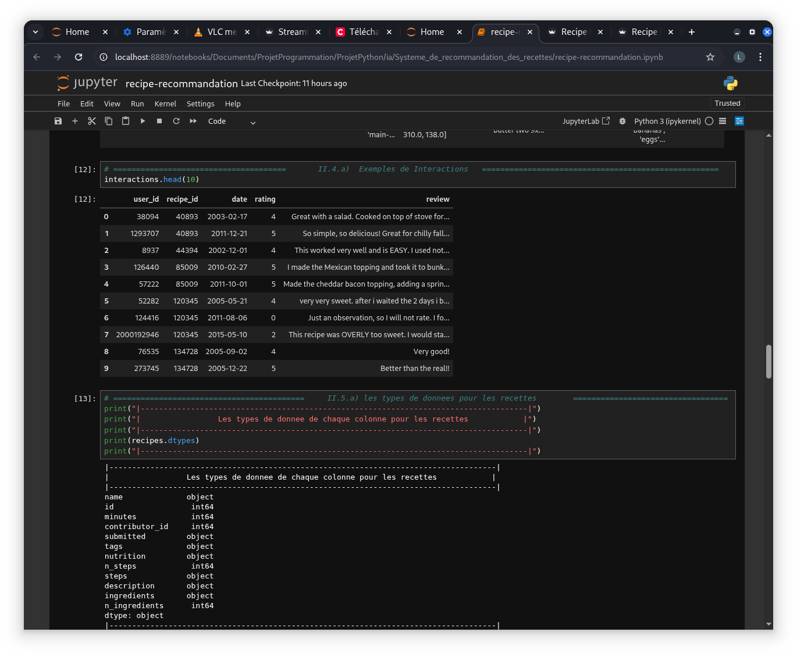
*Figure 4 :  Exploration du dataset: Affichage du type de chauque colonne*

### III. Nettoyage du dataset

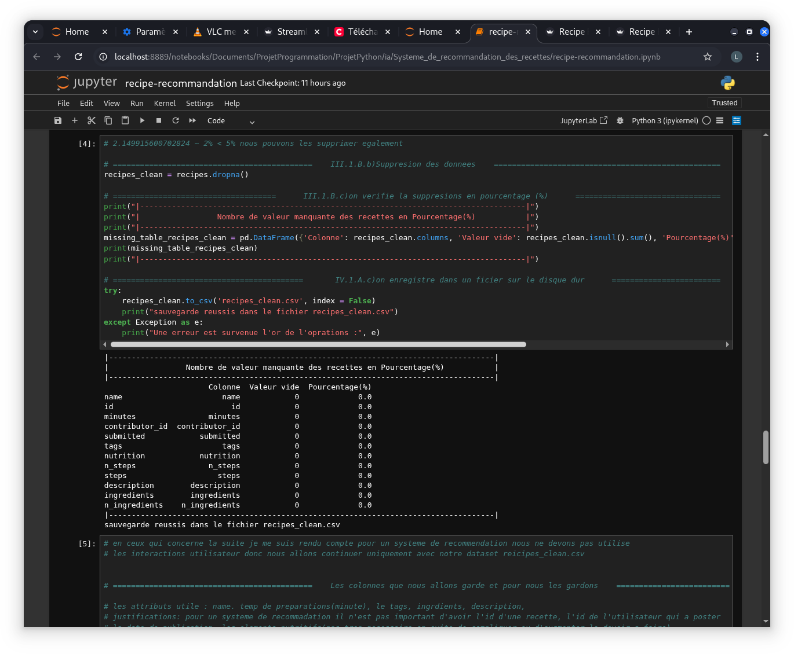
*Figure 1 :  Nettoyage du dataset:Suppression et sauvegarde du nouveau dataset propre dans le recipe_clean.csv et verification*
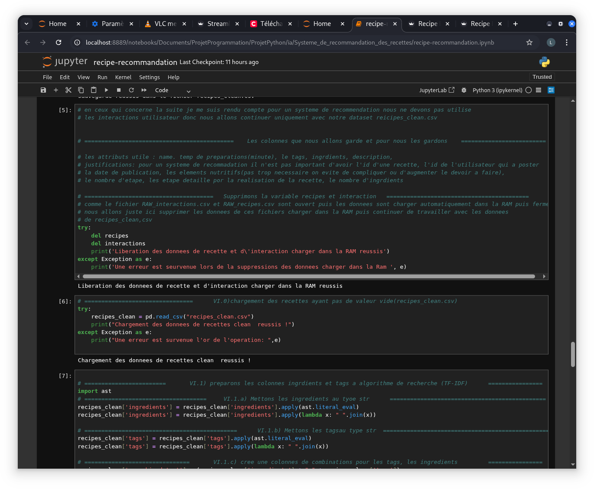
*Figure 2 :  Nettoyage du dataset: suppresion des anciens variable d'exploration du dataset et chargement d'une nouvelle variable de chargemnent pour le nouveau dataset recipes_clean.csv*

### III. Transformation des types du nouveau dataset

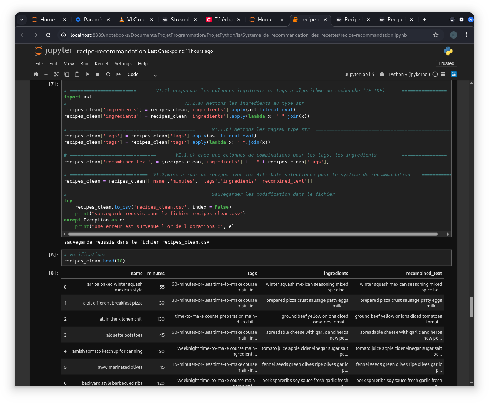
*Figure 1 :  Transformation du dataset: transformer le type des colonnes tags et ingredient en string et verification*

### III.Systeme de recommandation
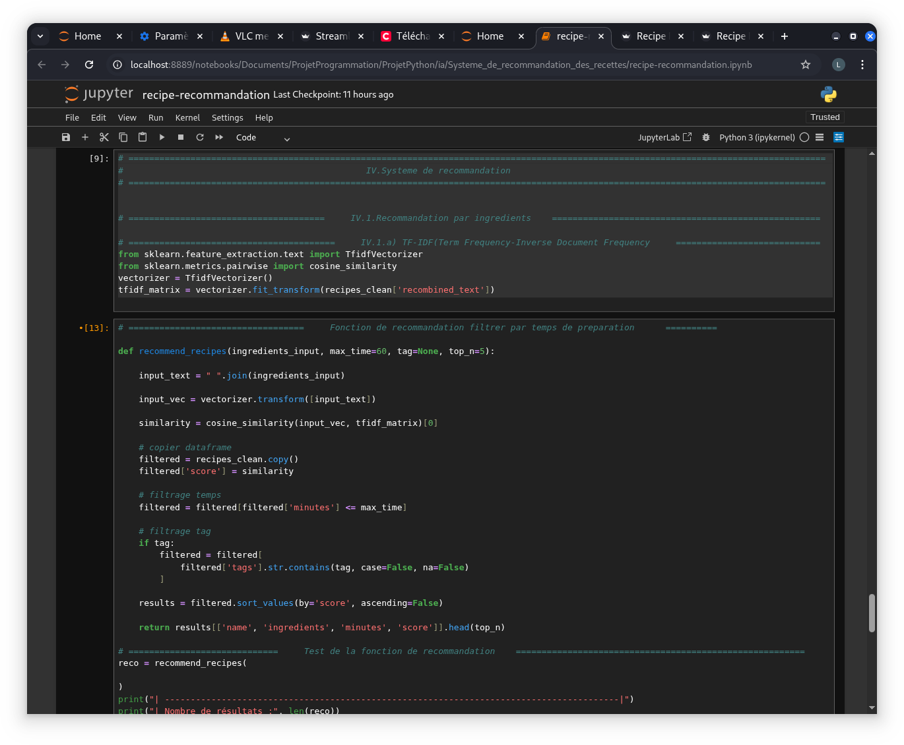
*Figure 2 :  Systeme de recommandation: Fonction de recommandation*

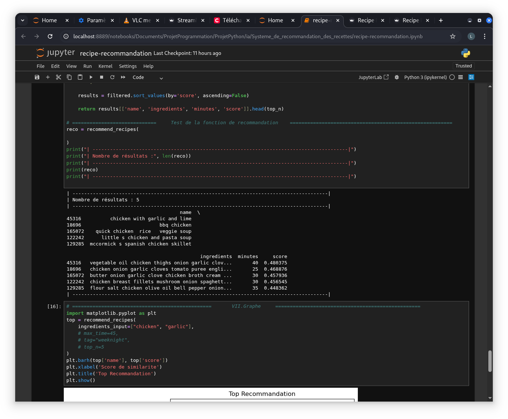
*Figure 2 :  Graphe de similarite*

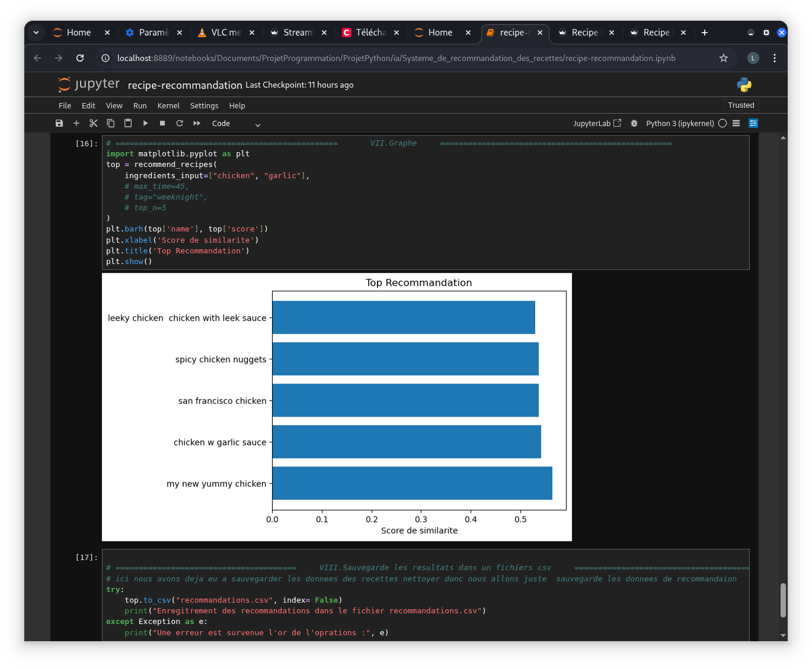
*Figure 2 :  Graphe de similarite*


*Figure 4 :  fichier de reocmmandation cree est stocker (ici nous avons ajouter une colonne recommandation aui contient la fusion tags+ingrdients+...)*


## Demo
veuillez regarder la video se trouvant dans le repertoire /screenshots/video.mp4


## Dificulter Rencontrer
1. *Documentation* : Comprendre reelement ceux qui etais demande 
2. *Outils* : s'adapter aux tout nouveau outils d'enprentissage a utilise(jupyter notebook)
3. *Manipulation des donnees* : du aux fait que je debut dans le domain j'ai  eu du mal a mainupule des donnees
4. *Materiel* : Default d'espace memoire l'ors de la similarite cosinus et de la comparairson(TF-IDF et similarite cosinus)

5. *Taille du dataset* : 130 Mo. Push GitHub bloqué par HTTP 408 j'ai du compresser avant de push. 


## Lecon retenu lors du projet
| Domain | Description |
| --- | --- |
| **Comment Fonction une Ia** | A travers une grande collection de donnees stocker mais avant doit etre traiter |
| **Chargement** | connaitre comment extraire les donnees et stocker dans un variable utilise en suit les outils qui le font comme pandas |
| **Exploration des donnees** | connaitre les attributs/colonnes, les enregistrement vide si il y a dans le dataset |
| **Nettoyage** | nettoyer (Supprimer ou remplacer les colonnes vide) |
| **Transformation** | transformer les donnees sous formats requis pour les manipuler(String pour les ingredients ou List) |
| **le font** | puis les transformer en vecteur avec les quels il pourra faire des analyse(similarite cosinus) sur le liens de rapprochement |

## Amelioration possibles 
- [ ] *Filtres avancés* : Temps de cuisson, régime végétarien, allergènes
- [ ] *interraction* : L'utilisateur pourra donnees ou laicer un commentaire
- [ ] *Modèle sémantique* : Remplacer TF-IDF par Sentence-BERT pour mieux capter "poulet" = "blanc de poulet"
- [ ] *Feedback utilisateur* : Système de like/dislike pour re-ranker les résultats
- [ ] *Déploiement* : Docker + hébergement Render/Heroku
- [ ] *Mode collaboratif* : "Les gens qui avaient tomate+oeuf ont aussi aimé..."

## Installation & Lancement
```bash
# 1. Clone le repo
git clone  https://github.com/evinaanderson/recipe-recommendation-system.git


# 2. Decompresee le dataset et deplacer 
decompresse le recipes_clean.zip et deplace le recipes_clean.csv dans le /app/

# 3. cree un venv et Telecharger les dependences(pandas, numpy, streamlit, matlplit)
dans /docs/requirement.txt il y a les dependences a installer

# 4. Lance l’API
python main.py
